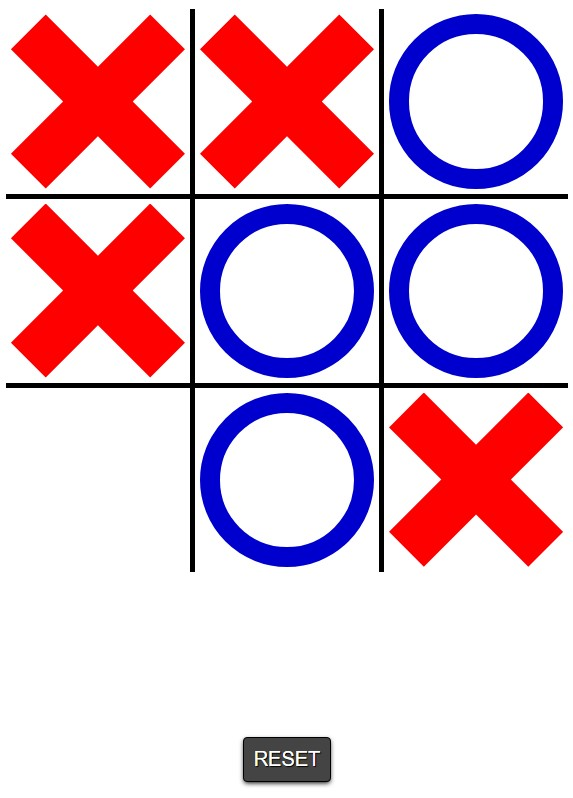

# Simplemente un Ta Te Ti
Tambien conocido como Tic Tac Toe en inglés.

Está hecho en React, te preguntaras ¿era necesario React para un simple tateti? ...no, pero pintó.
 
 

 
 

**Podes verlo andando acá: [TaTeTi](https://pixlking.github.io/tateti/)**

